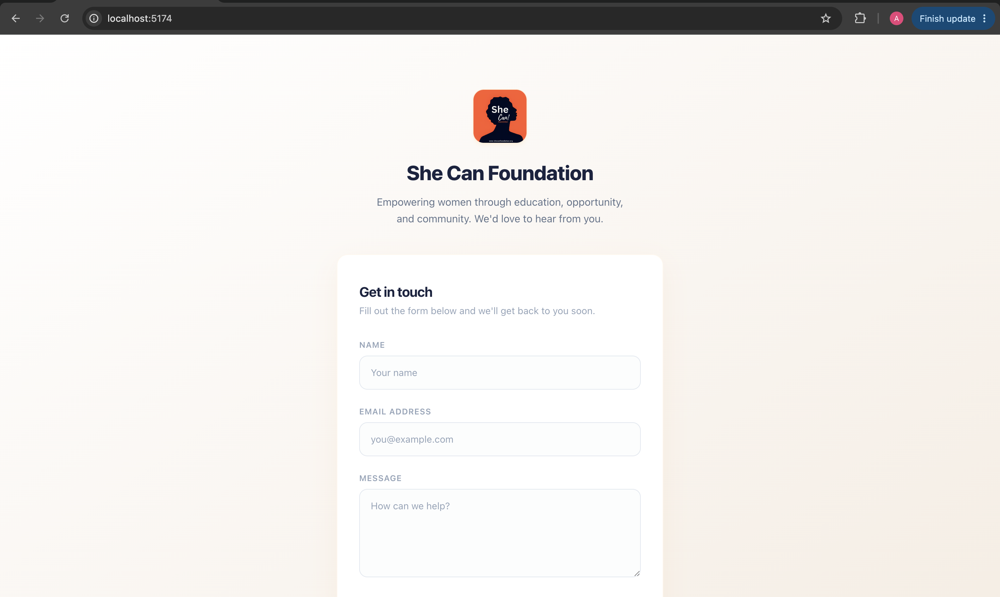

# She Can Foundation - Contact Portal

A full-stack contact form application built to empower the community. This project features a responsive React frontend with form validation and a robust Node.js/Express backend integrated with MongoDB via Mongoose.

## Screenshots

### Screenshot 1


### Screenshot 2


### Screenshot 3


### Screenshot 4


### Screenshot 5


## 🎯 Project Overview

This application provides a contact form where users can submit their information to the She Can Foundation. The submission includes validation on both the frontend and backend, ensuring data integrity and a smooth user experience.

**Features:**
- Responsive contact form with client-side validation
- Server-side validation and error handling
- MongoDB database for persistent storage

---

## 🏗️ Architecture Overview

```
She Can Foundation (Full Stack)
├── Frontend (React + Vite)
│   ├── Contact Form Component
│   └── Tailwind CSS Styling
├── Backend (Node.js + Express)
│   ├── REST API Endpoints
│   ├── MongoDB Integration (Mongoose)
└── Database (MongoDB)
```

### Tech Stack

| Layer | Technology |
|-------|-----------|
| Frontend | React 19, Vite, Tailwind CSS |
| Backend | Node.js, Express.js 5, Mongoose 9 |
| Database | MongoDB |

---

## 🛠️ Prerequisites

Ensure you have the following installed on your local machine:
- [Node.js](https://nodejs.org/) (v16 or higher recommended)
- [MongoDB](https://www.mongodb.com/) (local instance or [MongoDB Atlas](https://www.mongodb.com/cloud/atlas) cloud database)
- [Git](https://git-scm.com/)

---

## 📦 Installation & Setup

### Clone the Repository

```bash
git clone https://github.com/AdityaBawankule1/Message
cd "She Can Foundation - Full Stack"
```

### 1. Backend Setup

1. Navigate to the backend directory:
```bash
cd backend
```

2. Install dependencies:
```bash
npm install
```

3. Create a `.env` file in the `backend` folder with the following configuration:
```env
PORT=5000
MONGO_URI=<your key>
```

4. Start the backend server:
```bash
npm run dev
```

The backend will start on `http://localhost:5000`

---

### 2. Frontend Setup

1. Navigate to the frontend directory:
```bash
cd frontend
```

2. Install dependencies:
```bash
npm install
```

3. Start the development server:
```bash
npm run dev
```

The frontend will start on `http://localhost:5173`

---

## 🚀 Running the Application

### Development Mode

**Terminal 1 - Backend:**
```bash
cd backend
npm run dev
```

**Terminal 2 - Frontend:**
```bash
cd frontend
npm run dev
```

Once both servers are running:
- Frontend: Open `http://localhost:5173` in your browser
- Backend API: `http://localhost:5000/api/contact`

## 📁 Project Structure

```
.
├── backend/
│   ├── config/
│   │   └── db.js                    # MongoDB connection setup
│   ├── controllers/
│   │   └── contactController.js     # Business logic for contact submissions
│   ├── models/
│   │   └── Contact.js               # MongoDB Contact schema
│   ├── routes/
│   │   └── contactRoutes.js         # API route definitions
│   ├── server.js                    # Express server entry point
│   └── package.json
├── frontend/
│   ├── src/
│   │   ├── components/
│   │   │   ├── forms/
│   │   │   │   └── ContactForm.jsx  # Contact form component
│   │   │   └── ui/
│   │   │       └── Button.jsx       # Reusable button component
│   │   ├── api/
│   │   │   └── axios.js             # API client configuration
│   │   ├── assets/                  # Images and static files
│   │   ├── validation/
│   │   │   └── contactSchema.js     # Zod validation schema
│   │   ├── App.jsx                  # Main app component
│   │   ├── main.jsx                 # Entry point
│   │   └── index.css                # Global styles
│   ├── vite.config.js               # Vite configuration
│   ├── eslint.config.js             # ESLint configuration
│   └── package.json
├── Screenshots/
├── package.json                     # Root package configuration
└── README.md                        # This file
```

---

## ✅ Available Scripts

### Backend Scripts

```bash
npm start    # Start the production server
npm run dev  # Start with Nodemon (auto-reload on file changes)
npm test     # Run tests (not yet configured)
```

### Frontend Scripts

```bash
npm run dev      # Start development server with Vite
npm run build    # Build for production
npm run lint     # Run ESLint
npm run preview  # Preview production build
```

---

## 🐛 Troubleshooting

### Backend Connection Issues (macOS)
If you encounter connection errors on macOS, try:
```bash
# Use IPv6 loopback address
http://[::1]:5000
```

### Port Already in Use
```bash
# Find and kill the process using port 5000
lsof -i :5000
kill -9 <PID>
```

### MongoDB Connection Error
- Ensure MongoDB is running locally: `brew services start mongodb-community`
- Or use MongoDB Atlas with a valid connection string
- Check that `MONGO_URI` in `.env` is correct

### Module Not Found
```bash
# Clear node_modules and reinstall
rm -rf node_modules package-lock.json
npm install
```

---

## 📝 Environment Variables

### Backend (.env)
```env
PORT=5000                              # Server port
MONGO_URI=mongodb://localhost:27017/   # MongoDB connection string
NODE_ENV=development                   # Environment mode
```

### Frontend
The frontend uses `http://[::1]:5000` (IPv6 loopback) for API calls. Modify in [frontend/src/App.jsx](frontend/src/App.jsx) if needed.

---

## 📄 License

This project is licensed under the ISC License - see the LICENSE file for details.

---
